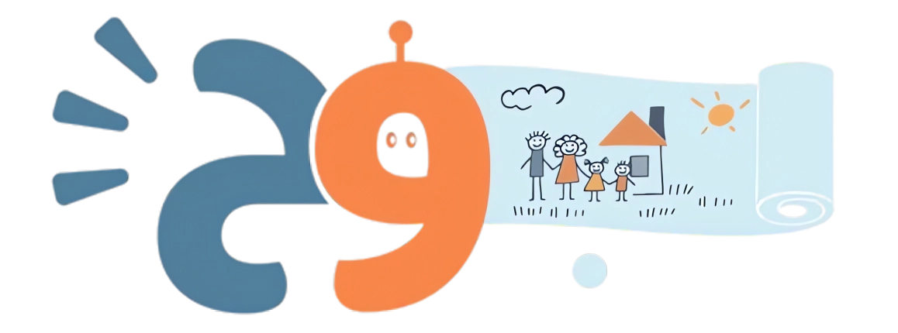

  

<h1 align="center">BOUH</h1>

An AI-based mobile application that analyzes children's drawings to detect emotional states and provide caregivers with guidance, insights, and access to professional mental health support.

---

## Overview

Children often express emotions through drawings when they cannot describe them verbally. BOUH helps caregivers understand these emotional signals using AI-powered drawing analysis and structured professional support.

The system analyzes children's drawings, classifies the detected emotional state, and generates an interpretation to help caregivers understand what the child might be feeling. It also allows caregivers to track emotional patterns over time and connect with licensed doctors for professional consultation when needed.

---

